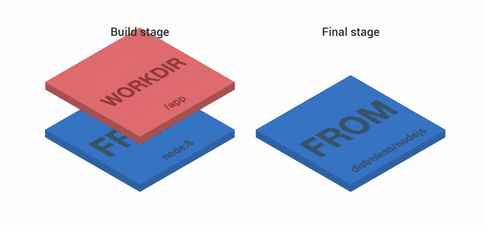
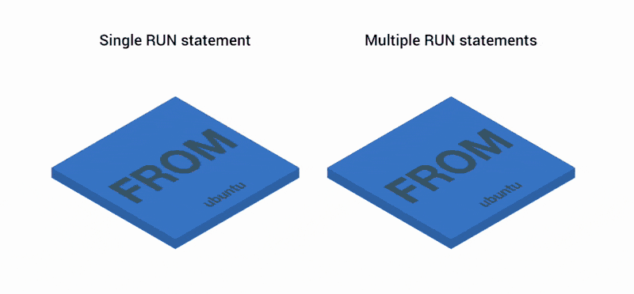

@snap[north span-100 text-center]
## Docker 学习分享
@snapend

@snap[midpoint span-100 text-center]
@size[1em](—— 如何生成一个更小的 Docker 镜像)
@size[0.5em](By FSSlc)
@snapend

---

@snap[north span-100 text-center]
## Why?
@snapend

- 减少下载时间，节省带宽
- 减少构建时间
- 减少磁盘占用
- 节省等待时间，加快启动，加快部署速度
- 加强安全性，因为包含更少文件

--- 

@snap[north span-100 text-center]
## How?
@snapend

@snap[midpoint span-100 text-center fragment]
#### 可以从哪几方面考虑生成更小的 Docker 镜像？

@ul
- 制作阶段 @note[编写 Dockerfile时]
- 构建阶段 @note[构建镜像时]
@ulend
@snapend

---

@snap[north span-100 text-center]
## 制作阶段
@snapend

@snap[midpoint span-100 text-center]
#### 在编写 Dockerfile 时可以考虑的优化

@fa[arrow-down]
@snapend

+++
@snap[north span-100 text-center]
### 选择合适的基础镜像
@snapend

@snap[midpoint span-100 text-left fragment]
- 使用小的基础镜像
    - FROM scratch
    - alpine
    - busybox
    - [distroless](https://github.com/GoogleContainerTools/distroless)

- 使用官方镜像 @note[查看最佳实践示例，用以参考学习]
    - https://github.com/docker-library

- 自己构建基础镜像 @note[一个 Python 镜像的示例]
    - https://github.com/jfloff/alpine-python
@snapend

+++

@snap[north span-100 text-center]
### 使用多阶段构建
@snapend

@snap[midpoint span-100 fragment]
- [官方介绍文档](https://docs.docker.com/develop/develop-images/multistage-build/)
- [上文的一个中文翻译](https://linux.cn/article-9133-1.html)
@snapend

@snap[midpoint span-100 fragment]

@snapend
+++ 

@snap[north span-100 text-center]
### 减少构建层数 
@snapend

@snap[west span-60 text-center fragment]

@snapend 

@snap[east span-40 text-center fragment]

@snapend

Note:
每个 RUN COPY ADD 命令会构建一个层(1.10+)

+++ 

@snap[north span-100 text-center]
### 避免不必要的文件
@snapend

@ul
- .dockerignore 
- 只添加必要的文件与目录
- 删除不必要的文件
    - 删除包缓存
    - 删除构建时的源码包
- 不安装不必要的软件，不安装 debug 工具
@ulend

Note:
下面是两篇 .dockerignore 参考文章
https://docs.docker.com/engine/reference/builder/#dockerignore-file
https://codefresh.io/docker-tutorial/not-ignore-dockerignore-2/
--- 

@snap[north span-100 text-center]
## 构建阶段
@snapend

@snap[midpoint span-100 text-center]
#### 在构建镜像时可以考虑的优化

@fa[arrow-down]
@snapend

+++ 

@snap[north span-100 text-center]
### docker 命令
@snapend

@snap[midpoint span-100 text-center fragment]
- docker build 自己的选项
    - @size[0.5em](`--force-rm` 总是删除临时容器)
- docker export + docker import
    @snap[font-source-pro]
    - @size[0.5em](docker export <CONTAINER ID> | docker import - some-image-name:latest)
    @snapend
@snapend

+++

@snap[north span-100 text-center]
### 工具
@snapend

@snap[west span-50 text-center]
#### 检测工具
- [dockerfilelint](https://github.com/replicatedhq/dockerfilelint)
  - @size[0.6em]([在线网站](https://www.fromlatest.io))
- [docker-slim](https://github.com/docker-slim/docker-slim)
@snapend

@snap[east span-50 text-center]
#### 压缩工具
- [docker-squash](https://github.com/goldmann/docker-squash)
- [docker-slim](https://github.com/docker-slim/docker-slim)
- [minicon](https://github.com/grycap/minicon)
@snapend

---

@snap[north span-100 text-center]
### 优化的考虑

#### **适合的才是最好的！**
@snapend

@snap[midpoint span-100 fragment text-10 text-center]
- 确定哪些东西可以在镜像中删除
- 确定是否有更好的基础镜像
- 考虑如何减少层
- 如何减少构建时间（合理利用 Docker 缓存）
    - 经常变化的放到最后
    - 将安装命令放到前面
@snapend

@snap[north span-100 text-center]
### 参考
@snapend

@snap[midpoint span-100 text-left text-05]
- https://linuxhint.com/optimizing-docker-images/
- https://rollout.io/blog/reduce-docker-image-size/
- https://rollout.io/blog/alpine-based-docker-images-make-difference-real-world-apps/
- https://resources.codeship.com/hubfs/Webinar_Resources/Reducing_Docker_Image_Sizes_Codeship_Webinar_Slides.pdf
- https://pythonspeed.com/docker/
- https://blog.xebialabs.com/2017/05/18/5-docker-utilities-you-should-know/
- https://itnext.io/3-simple-tricks-for-smaller-docker-images-f0d2bda17d1e
- https://towardsdatascience.com/how-to-build-slim-docker-images-fast-ecc246d7f4a7
- https://www.digitalocean.com/community/tutorials/how-to-optimize-docker-images-for-production
- https://learnk8s.io/blog/smaller-docker-images
@snapend
